# Project Title

nutritiontracker

Access my site at https://nutrition-tracker-psi.vercel.app

## About The App


"[nutritiontracker] is a nutrition tracker app that allows users to create their accounts and manage their nutrition information. Upon signing up, users can set macronutrient goals and monitor their progress with interactive charts available on their personalized dashboard. Utilizing a nutrition API, users can search for specific foods, view detailed nutritional information, and visualize data with charts before adding selected items to their dashboard for goal comparison.

Each day, users can submit their food log entries, which are accessible on their dedicated food log page. Entries are sorted by date, with pagination implemented to accommodate growing logs. The site ensures form validation during account creation and provides options for users to customize their experience by changing their avatar and selecting a dark mode theme.

Dynamic chart updates enable users to compare their set goals with the nutritional content of the foods they've added to their log, providing real-time insights into their dietary habits and progress."

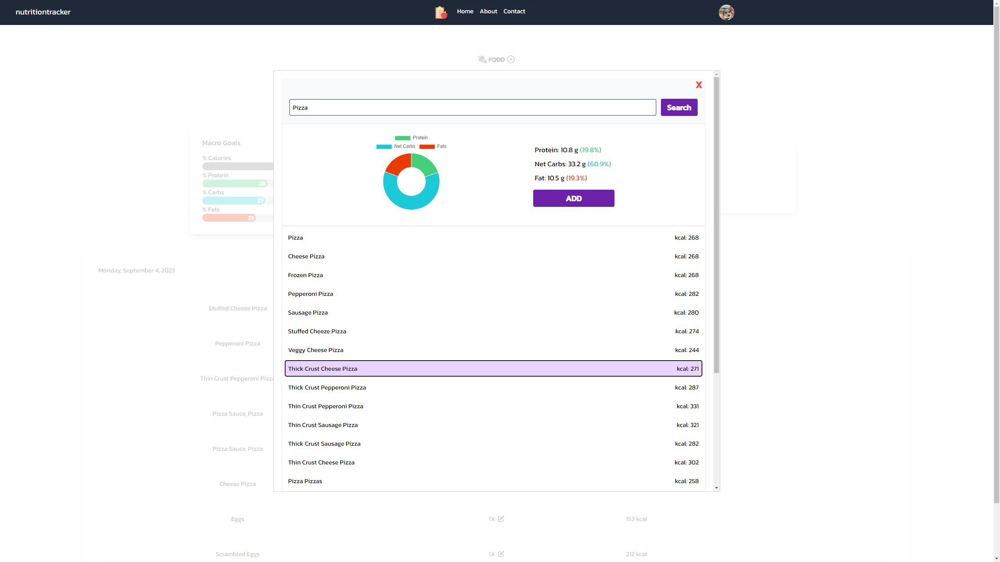
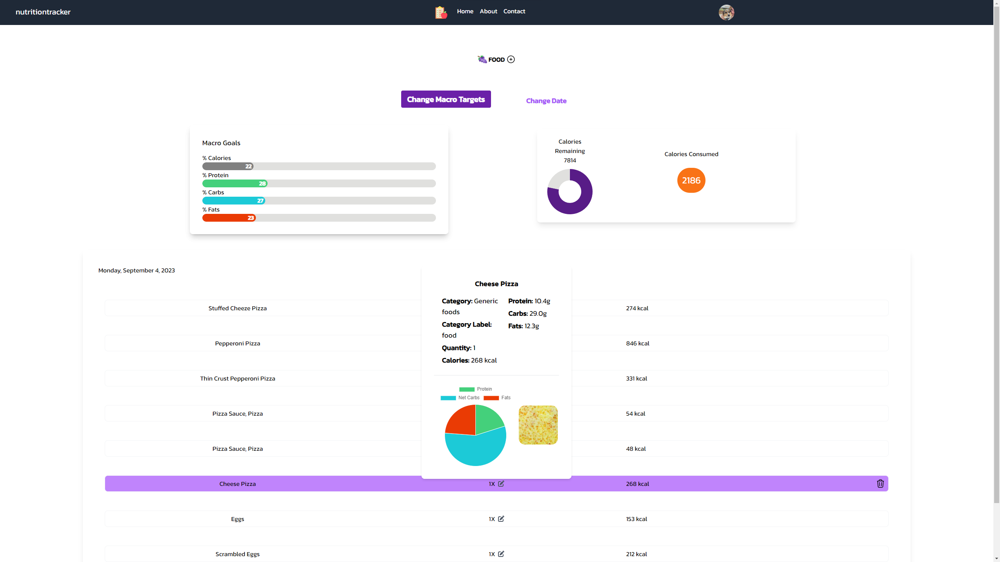
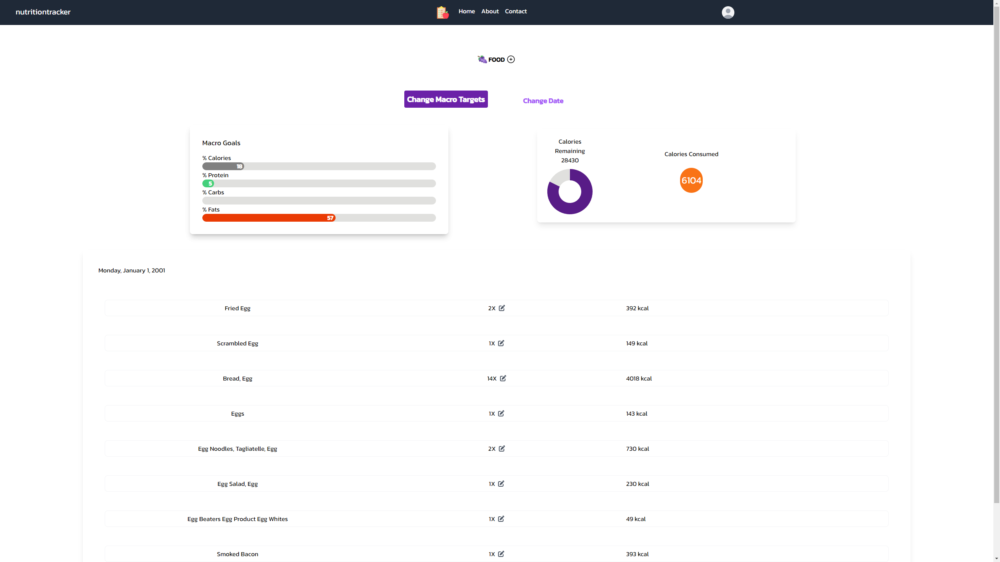
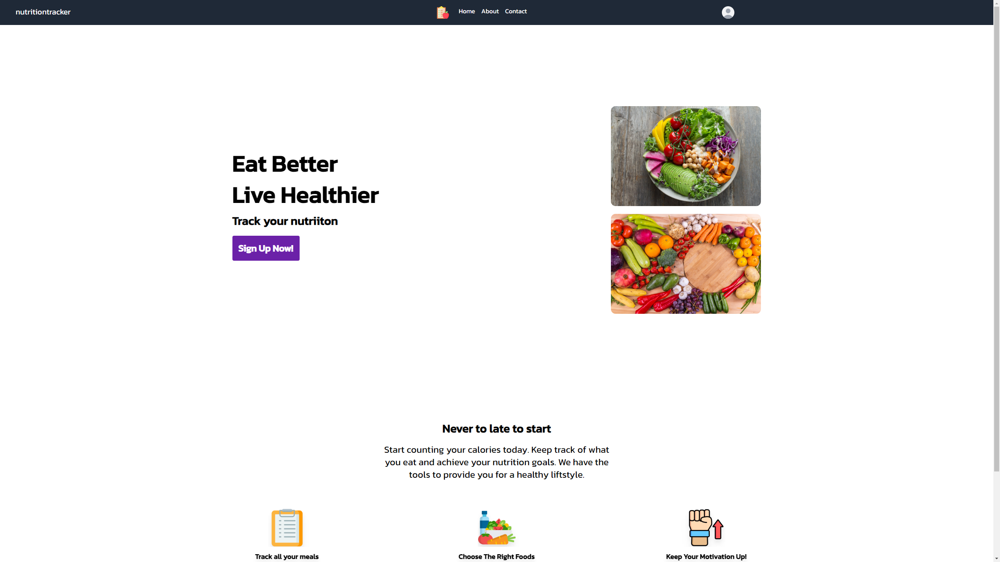
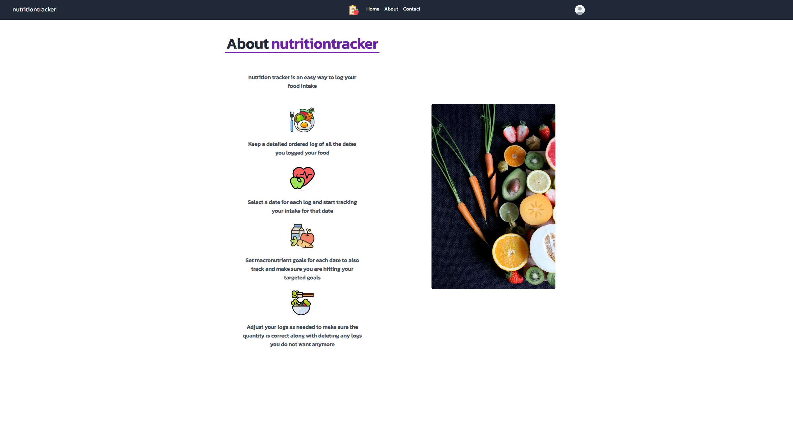
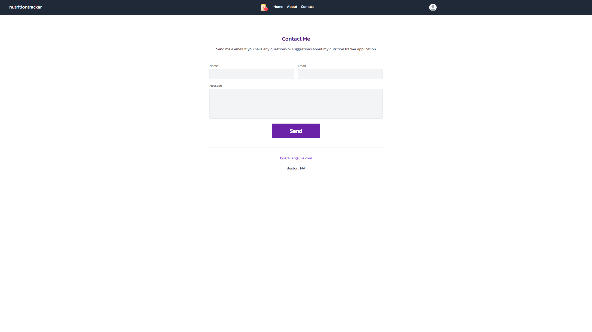
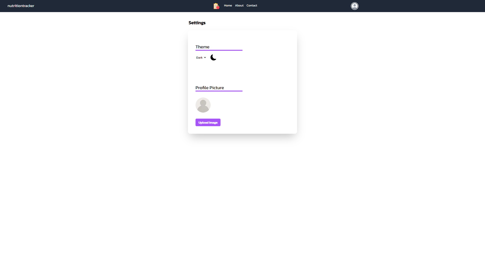
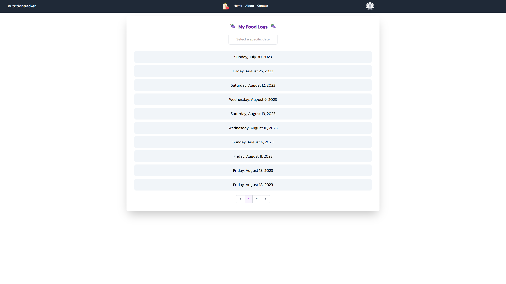
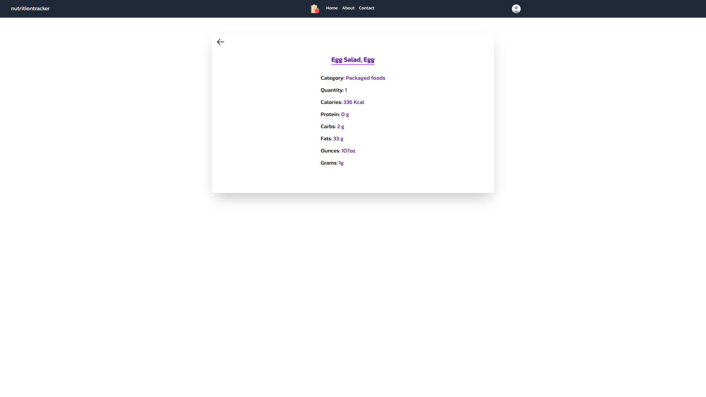
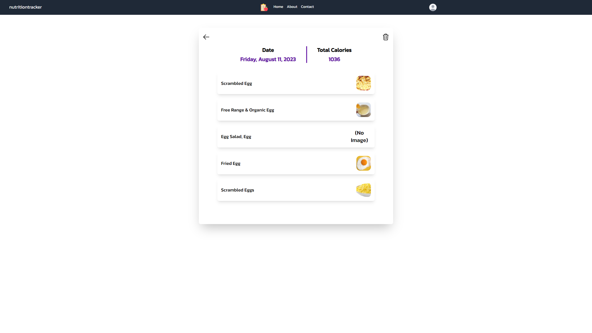
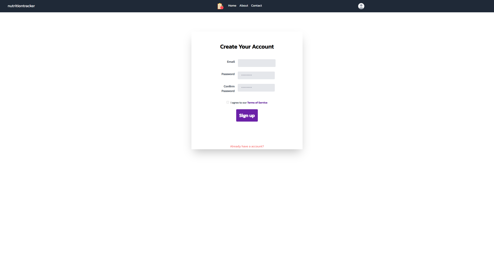


## Technologies

  &nbsp;
  &nbsp;
  &nbsp;
  &nbsp;
  &nbsp;
  &nbsp;
  &nbsp;


## Approach

Developed using Next.js with server-side rendering for efficient server components. Utilizes Typescript for comprehensive type checking, ensuring code integrity and scalability. Styled with Tailwind CSS for a visually appealing and responsive design across devices. Integrated with Prisma and MySQL for reliable database management and seamless data storage. Implements authentication with NextAuth.js for secure user authentication and authorization, enhancing user privacy and data security. Additionally, leverages the Nutrition API for fetching nutritional data, enriching the user experience with accurate and up-to-date information.


 


<!-- This is a [Next.js](https://nextjs.org/) project bootstrapped with [`create-next-app`](https://github.com/vercel/next.js/tree/canary/packages/create-next-app).

## Getting Started

First, run the development server:

```bash
npm run dev
# or
yarn dev
# or
pnpm dev
```

Open [http://localhost:3000](http://localhost:3000) with your browser to see the result.

You can start editing the page by modifying `app/page.tsx`. The page auto-updates as you edit the file.

[API routes](https://nextjs.org/docs/api-routes/introduction) can be accessed on [http://localhost:3000/api/hello](http://localhost:3000/api/hello). This endpoint can be edited in `pages/api/hello.ts`.

The `pages/api` directory is mapped to `/api/*`. Files in this directory are treated as [API routes](https://nextjs.org/docs/api-routes/introduction) instead of React pages.

This project uses [`next/font`](https://nextjs.org/docs/basic-features/font-optimization) to automatically optimize and load Inter, a custom Google Font.

## Learn More

To learn more about Next.js, take a look at the following resources:

- [Next.js Documentation](https://nextjs.org/docs) - learn about Next.js features and API.
- [Learn Next.js](https://nextjs.org/learn) - an interactive Next.js tutorial.

You can check out [the Next.js GitHub repository](https://github.com/vercel/next.js/) - your feedback and contributions are welcome!

## Deploy on Vercel

The easiest way to deploy your Next.js app is to use the [Vercel Platform](https://vercel.com/new?utm_medium=default-template&filter=next.js&utm_source=create-next-app&utm_campaign=create-next-app-readme) from the creators of Next.js.

Check out our [Next.js deployment documentation](https://nextjs.org/docs/deployment) for more details. -->
